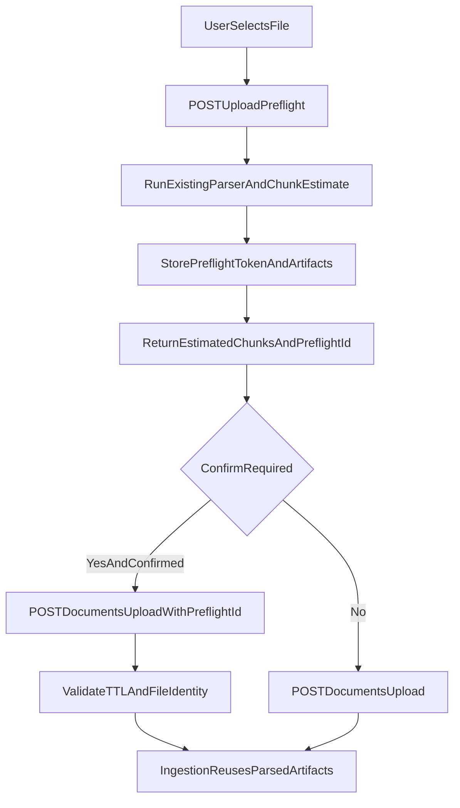

# Accurate Chunk Guard via Preflight Reuse

## Goal
Replace the current conservative binary-file chunk estimate with an accurate parser-based preflight estimate, while avoiding parse-twice overhead by reusing preflight artifacts during confirmed ingestion.

## Implementation Strategy

### 1) Add preflight token model and storage lifecycle
- Introduce a small, workspace-scoped preflight registry (TTL-based) to bind:
  - `preflight_id`
  - file identity (content hash + filename)
  - parser engine + parse artifacts location
  - accurate `estimated_chunks`
  - creation/expiry timestamps
- Keep this in the existing shared-state pattern (workspace-scoped namespace + lock), avoiding backend-specific storage coupling.
- Add cleanup logic for expired entries during normal access paths (lazy eviction) to keep scope minimal.

Likely files:
- [lightrag/api/routers/document_routes.py](lightrag/api/routers/document_routes.py)
- [lightrag/kg/shared_storage.py](lightrag/kg/shared_storage.py) (only if a new namespace helper is required)

### 2) Build parser-backed preflight estimator (no custom parser)
- Reuse existing parser-routing/parser execution code paths already used by ingestion (native/docling/mineru) to obtain real extracted text/blocks.
- Compute chunk estimate using the same tokenizer + chunk options resolution used by ingestion pipeline (`process_options` aware).
- Persist reusable parse artifact pointer(s) in the preflight record.
- Return a typed response model:
  - `preflight_id`
  - `estimated_chunks`
  - `max_chunks`
  - `confirm_required`
  - optional `expires_at`

Likely files:
- [lightrag/api/routers/document_routes.py](lightrag/api/routers/document_routes.py)
- [lightrag/parser/routing.py](lightrag/parser/routing.py) (read-only reuse; no behavior drift)
- [lightrag/pipeline.py](lightrag/pipeline.py) (only if a small helper extraction is needed)

### 3) Extend upload API contract to accept preflight reuse
- Extend `/documents/upload` form contract with optional `preflight_id`.
- On upload with `confirm_large_ingestion=true` + `preflight_id`:
  - validate token ownership/TTL/file identity
  - attach/reuse preflight parse artifact metadata so ingestion skips reparsing
- If token missing/expired/mismatch, fallback safely:
  - either reject with explicit error requiring preflight refresh
  - or fallback to current path (choose explicit reject to prevent accidental double parse)

Likely files:
- [lightrag/api/routers/document_routes.py](lightrag/api/routers/document_routes.py)
- [lightrag/pipeline.py](lightrag/pipeline.py) (small hook to honor pre-parsed artifact pointer)

### 4) Minimal WebUI flow (Upload dialog)
- Keep current UX structure, but replace “retry blind confirm” with preflight-driven confirm:
  1. User selects file
  2. UI calls preflight endpoint
  3. If `confirm_required`, show modal with accurate estimate
  4. On confirm, call upload with `confirm_large_ingestion=true` + `preflight_id`
- Preserve existing error behavior for non-guard failures.

Likely files:
- [lightrag_webui/src/api/lightrag.ts](lightrag_webui/src/api/lightrag.ts)
- [lightrag_webui/src/components/documents/UploadDocumentsDialog.tsx](lightrag_webui/src/components/documents/UploadDocumentsDialog.tsx)
- [lightrag_webui/src/locales/en.json](lightrag_webui/src/locales/en.json)

### 5) Docs and compatibility notes
- Update API docs with new preflight endpoint + `preflight_id` behavior.
- Clarify that binary-file estimates are now parser-accurate when preflight is used.
- Document TTL and mismatch/expiry responses.

Likely files:
- [docs/LightRAG-API-Server.md](docs/LightRAG-API-Server.md)

## Data Flow

## Acceptance Criteria
- Large binary upload estimate tracks actual chunk count closely (no byte/4 inflation for supported parsers).
- Confirmed upload with `preflight_id` does not re-run parsing for the same file.
- Expired or mismatched `preflight_id` returns clear 4xx with actionable message.
- Existing non-preflight upload behavior remains functional.
- WebUI modal shows accurate estimate and submits `preflight_id` on confirm.
- Tests cover preflight accuracy path, token expiry/mismatch, and upload reuse path.

## Test Plan
- Backend unit/integration-style tests:
  - preflight returns estimate + token for binary files
  - upload with valid token reuses parse artifacts
  - expired token and hash mismatch fail predictably
- Existing ingestion control tests still pass.
- WebUI:
  - lint/tests for new API call and dialog branch
  - manual verification: preflight estimate vs observed chunk count and no duplicate parse logs.