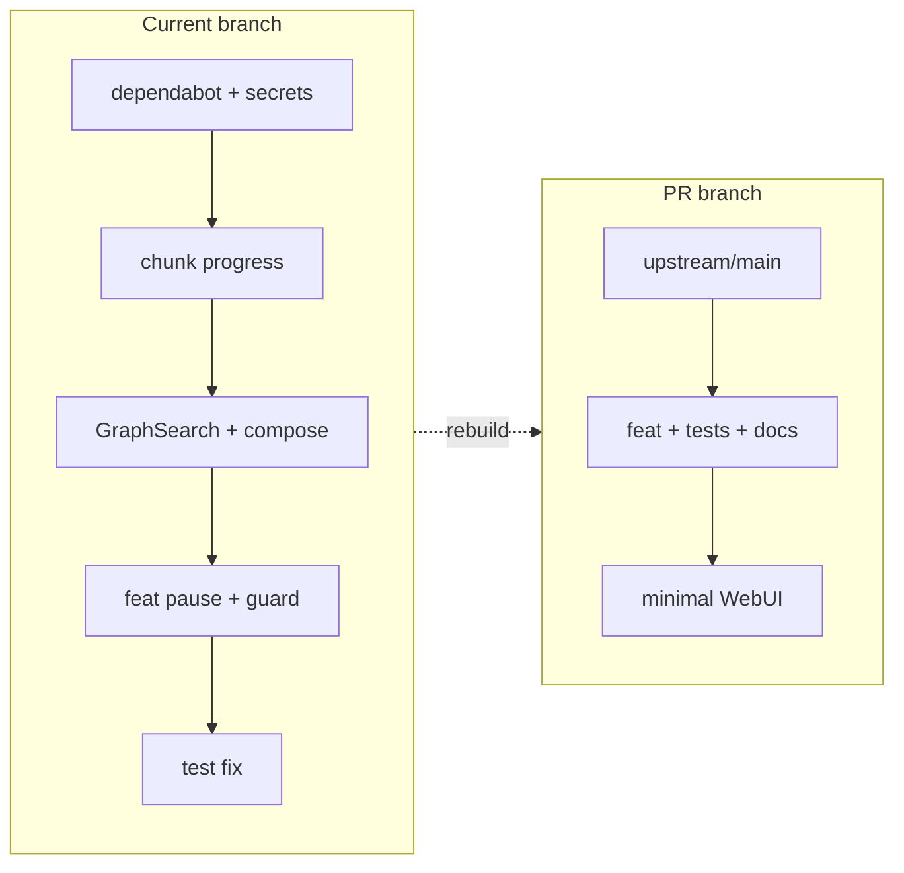

# PR-ready plan: ingestion pause + chunk guard

## Current state (problem)

Branch [`cursor/ingestion-pause-chunk-guard-3fb7`](cursor/ingestion-pause-chunk-guard-3fb7) has **5 commits** and **20 files** vs upstream, but only **2 commits / 10 files** implement the target feature:

| Keep | Drop |
|------|------|
| `1e8382a4` feat: pause + chunk guard | `9a126dad` dependabot + **`.env.investment`**, `env.investment.old` (must never go upstream) |
| `66e290f8` test import fix | `594691da` GraphSearch + `bun.lock` + `docker-compose-multi.yml` |
| Minimal WebUI (new work) | `349d4ef5` chunk progress (`shared_storage.py`, `test_pipeline_chunk_progress.py`, chunk UI lines) |

Upstream is ~229 commits ahead; the PR must target **`HKUDS/LightRAG:main`** per [AGENTS.md](AGENTS.md) and [.github/CONTRIBUTING.md](.github/CONTRIBUTING.md).



---

## Community demand (upstream issues)

There is **no open issue titled “pause ingestion”**, but several threads show real demand for what this PR delivers. Use these links in the PR description so maintainers see it fills gaps, not duplicates work.

### Strong alignment

| Issue | Demand | How this PR helps | Notes |
|-------|--------|-------------------|-------|
| [#868](https://github.com/HKUDS/LightRAG/issues/868) — stop processing gracefully | Endpoints + UI to stop before reboot; avoid Ctrl+C corrupting JSON stores; per-file stop | **Pause/resume** + WebUI buttons; `DocStatus.PAUSED` preserves work vs cancel marking **FAILED** | Closed Jul 2025; cancel_pipeline exists upstream but is **destructive** — position PR as “non-destructive stop + resume” |
| [#852](https://github.com/HKUDS/LightRAG/issues/852) — UI hangs on many/large uploads | Long runs, frozen UI, need control during bulk ingest | Chunk guard reduces accidental huge jobs; pause avoids only choice of cancel or refresh | Maintainer deprioritized progress bar; wanted **failure list, filenames, upload preview** — we partially address “control before/during ingest,” not full preview |
| [#2690](https://github.com/HKUDS/LightRAG/issues/2690) — delete while pipeline busy | 10–30+ min jobs block library cleanup | Pause lets users stop cleanly before maintenance (related, not a fix for #2690) | Separate PR #2886 may address delete; mention as adjacent pain |
| [#1380](https://github.com/HKUDS/LightRAG/issues/1380) — restart stuck processing | Scan/restart when pipeline hangs | **Resume** re-queues paused docs; does not replace Scan | Link lightly |

### Complementary (do not claim to solve)

| Item | Relationship |
|------|----------------|
| [PR #2622](https://github.com/HKUDS/LightRAG/pull/2622) — `MAX_UPLOAD_SIZE` (bytes) | **Chunk guard is complementary**: limits estimated **semantic chunks / LLM cost**, not file bytes. Document both in API docs. |
| [#2300](https://github.com/HKUDS/LightRAG/issues/2300), [#1630](https://github.com/HKUDS/LightRAG/issues/1630) — large doc failures | Embedding/timeout bugs — guard may prevent starting obviously huge jobs but does not fix Ollama EOF/timeouts |
| [#2332](https://github.com/HKUDS/LightRAG/issues/2332) — pre-chunked ingestion | Different feature (custom chunking_func) |
| [#2744](https://github.com/HKUDS/LightRAG/issues/2744) — post-insert webhooks | Lower priority per maintainer; out of scope |

### PR messaging (recommended)

- **Title angle:** “Non-destructive ingestion pause/resume and large-ingestion confirmation”
- **Closes/relates:** `Relates to #868, #852` (do not use `Fixes` unless you open a dedicated issue)
- **Before opening PR (optional, helps review speed):** File a short [Feature Request](https://github.com/HKUDS/LightRAG/issues/new?template=feature_request.yml) summarizing pause vs cancel and chunk guard vs `MAX_UPLOAD_SIZE`, then link it in the PR

### What maintainers already have (avoid overclaiming)

- `POST /documents/cancel_pipeline` — cooperative cancel, marks docs **FAILED**
- `GET /documents/track_status/{track_id}` — job monitoring
- `MAX_UPLOAD_SIZE` — byte limit on upload stream

**Gap this PR fills:** pause without losing retry state (`PAUSED` + resume), and explicit user confirmation when estimated chunks exceed `MAX_INGESTION_CHUNKS`.

---

## Phase 1: Clean branch from upstream

1. **Fetch** `upstream` and create a fresh PR branch:
   ```bash
   git fetch upstream
   git checkout -b pr/ingestion-pause-chunk-guard upstream/main
   ```

2. **Cherry-pick only** the feature commits (resolve conflicts against current `main`):
   ```bash
   git cherry-pick 1e8382a4 66e290f8
   ```

3. **Verify the diff is ~10 backend files** (expected from the original feature commit):
   - [env.example](env.example)
   - [lightrag/api/config.py](lightrag/api/config.py)
   - [lightrag/api/lightrag_server.py](lightrag/api/lightrag_server.py)
   - [lightrag/api/routers/document_routes.py](lightrag/api/routers/document_routes.py)
   - [lightrag/api/routers/ingestion_routes.py](lightrag/api/routers/ingestion_routes.py) (new)
   - [lightrag/base.py](lightrag/base.py) — `DocStatus.PAUSED`
   - [lightrag/exceptions.py](lightrag/exceptions.py) — `PipelinePausedException`
   - [lightrag/lightrag.py](lightrag/lightrag.py)
   - [lightrag/operate.py](lightrag/operate.py)
   - [tests/test_ingestion_controls.py](tests/test_ingestion_controls.py)

4. **Confirm absent** after cherry-pick: `.env.investment`, `env.investment.old`, `docker-compose-multi.yml`, `lightrag/kg/shared_storage.py` chunk-progress helpers, `tests/test_pipeline_chunk_progress.py`, `GraphSearch.tsx`, `bun.lock` churn.

5. **Squash** into one commit (or two: feat + test fix) with a short imperative subject—drop Cursor “Problem/Approach/Risk” bodies and `Co-authored-by: Cursor Agent`.

---

## Phase 2: Trim “AI slop” in backend (minimal API surface)

Goal: mirror existing [`cancel_pipeline`](lightrag/api/routers/document_routes.py) patterns; avoid parallel state machines.

### Remove or simplify in [ingestion_routes.py](lightrag/api/routers/ingestion_routes.py)

| Item | Why trim |
|------|----------|
| `INGESTION_JOB_REGISTRY`, `IngestionJobRecord`, `register_ingestion_job`, `update_ingestion_job`, `GET /api/ingestion/jobs/{job_id}` | Duplicate of existing [`/documents/track_status/{track_id}`](lightrag/api/routers/document_routes.py); “best-effort in-memory” registry is not durable and adds review risk |
| `register_ingestion_job(track_id)` calls in [document_routes.py](lightrag/api/routers/document_routes.py) | Only existed to feed the registry |
| `IngestionControlResponse.model_config.json_schema_extra` example block | Verbose; other control models don’t need it |
| `max_chunks_override` on `InsertTextRequest` / `InsertTextsRequest` / upload `Form` | Prefer single `MAX_INGESTION_CHUNKS` env default unless you have a concrete per-request need; drops API clutter |
| `chunk_index` / `processed_docs` on job records | Coupled to dropped chunk-progress work; pause API doesn’t need them |

**Keep:** `POST /api/ingestion/pause/{job_id}`, `POST /api/ingestion/resume/{job_id}`, cooperative pause via `pipeline_status` + `DocStatus.PAUSED`, `mark_job_docs_paused` / `restore_paused_job_docs` (needed for idle-queue pause).

### Chunk guard in [document_routes.py](lightrag/api/routers/document_routes.py)

**Keep** (core value):
- `resolve_max_ingestion_chunks`, `estimate_chunk_count_*`, `enforce_max_ingestion_chunks*`
- `confirm_large_ingestion` on upload + text routes
- Structured `400` with `large_ingestion_requires_confirmation`

**Review for slop:**
- Long docstrings on every helper—match surrounding `document_routes.py` style (one-liners where neighbors are terse)
- `PipelineStatusResponse`: only add `pause_requested`, `paused`, `paused_job_id`, `active_track_ids` (no `chunks_*` / `chunk_progress` without chunk-progress backend)

### Core pipeline ([lightrag.py](lightrag/lightrag.py), [operate.py](lightrag/operate.py))

**Keep** pause checks parallel to cancellation (already in feature commit). Ensure no imports/calls to `register_pipeline_chunk_progress` remain after dropping commit `349d4ef5`.

### Docs (required for merge, not slop)

Add a focused section to [docs/LightRAG-API-Server.md](docs/LightRAG-API-Server.md):
- `MAX_INGESTION_CHUNKS` / `confirm_large_ingestion`
- `POST /api/ingestion/pause/{track_id}` and `resume/{track_id}` (job_id == upload `track_id`)
- Limitations: cooperative pause; binary file chunk count is estimated

---

## Phase 3: Minimal WebUI (your choice: include)

No pause/confirm UI exists on the feature commits today; add **4 touched files** only:

| File | Change |
|------|--------|
| [lightrag_webui/src/api/lightrag.ts](lightrag_webui/src/api/lightrag.ts) | Types for `pause_requested` / `paused` / `active_track_ids`; `pauseIngestion(jobId)`, `resumeIngestion(jobId)`; `uploadDocument(..., { confirmLargeIngestion })` |
| [lightrag_webui/src/components/documents/UploadDocumentsDialog.tsx](lightrag_webui/src/components/documents/UploadDocumentsDialog.tsx) | On `400` + `detail.confirm_large_ingestion_required`, confirm dialog, retry with `confirm_large_ingestion=true` |
| [lightrag_webui/src/components/documents/PipelineStatusDialog.tsx](lightrag_webui/src/components/documents/PipelineStatusDialog.tsx) | Pause / Resume beside Cancel; derive `jobId` from `status.paused_job_id` or `status.active_track_ids?.[0]`; mirror cancel confirm pattern |
| [lightrag_webui/src/locales/en.json](lightrag_webui/src/locales/en.json) | Strings only (match prior PRs that added `chunkProgress` with en-only) |

**Do not** port chunk-progress UI lines (`chunkProgress`, `currentDocId`) unless you also port the backend chunk-progress commit—which violates minimal scope.

**Do not** run broad `bun.lock` upgrades.

---

## Phase 4: Validation (CI parity)

Run before opening PR:

```bash
pre-commit run --all-files
python -m pytest tests -m offline -q
python -m pytest tests/test_ingestion_controls.py -q
ruff check .
cd lightrag_webui && bun run lint && bun test
```

CI runs offline pytest on **3.12 + 3.14** and pre-commit on all files ([.github/workflows/tests.yml](.github/workflows/tests.yml), [.github/workflows/linting.yaml](.github/workflows/linting.yaml)).

---

## Phase 5: Open PR upstream

1. Push branch to fork: `git push -u origin pr/ingestion-pause-chunk-guard`
2. Open PR: **base** `HKUDS/LightRAG` `main`, **head** `Slarty-code:pr/ingestion-pause-chunk-guard`
3. Fill [.github/pull_request_template.md](.github/pull_request_template.md):
   - **Why**: accidental large ingestions; only destructive cancel today (extends #868)
   - **Related**: #868, #852; complements `MAX_UPLOAD_SIZE` (#2622)
   - **Limitations**: cooperative pause; chunk estimate; WebUI confirm for upload only
   - **Test plan**: paste commands above
   - **curl samples** for pause/resume and guarded upload
4. Mark **Ready for review** (draft PRs skip CI)

---

## Expected final file set (~14 files)

**Backend (10):** as listed in Phase 1 + `docs/LightRAG-API-Server.md`

**Frontend (4):** `lightrag.ts`, `UploadDocumentsDialog.tsx`, `PipelineStatusDialog.tsx`, `en.json`

**Explicitly out of scope:** chunk progress, GraphSearch, compose/env secrets, dependabot lockfile, `max_chunks_override`, in-memory job registry endpoint.
